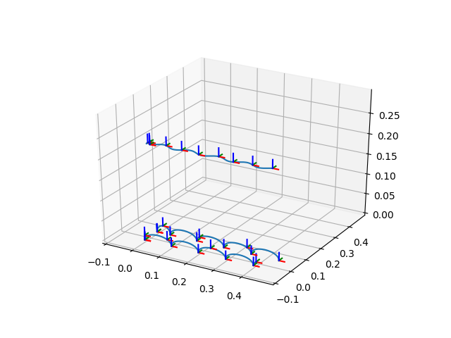
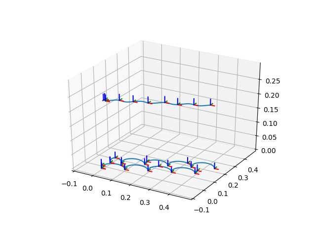
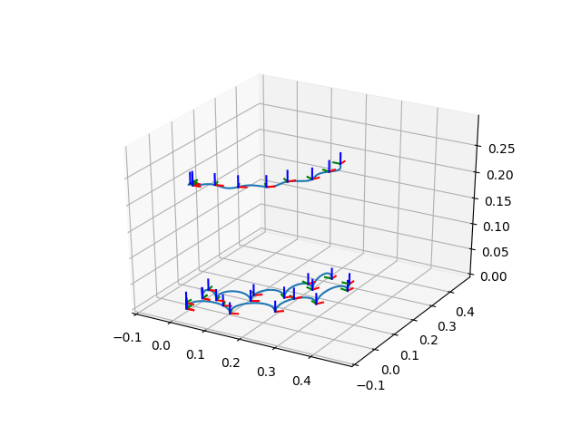

# Omnidirectional Walking Pattern Generation for Humanoid Robot using ZMP Preview Control

By: Eko Rudiawan 

**Overview**

This is an implementation of omnidirectional walking pattern generator of humanoid robot. The input is step length in x and y direction and step rotation. The output is COM trajectory, left foot and right foot trajectory in 3D space (x, y, z, roll, pitch, yaw). This is a basic concept how to implement a walk engine on humanoid robot. This code can be expanded with inverse kinematics solver to make a robot walk in desired command.

**Example Result**

1. cmd_x = 0.05, cmd_y = 0.00, and cmd_a = 0.00

    

2. cmd_x = 0.05, cmd_y = 0.02, and cmd_a = 0.00

    

3. cmd_x = 0.05, cmd_y = 0.00, and cmd_a = 10 degrees

    
    
**Reference**
[1] Kajita, Shuuji, et al. "Biped walking pattern generation by using preview control of zero-moment point." 2003 IEEE International Conference on Robotics and Automation (Cat. No. 03CH37422). Vol. 2. IEEE, 2003.
